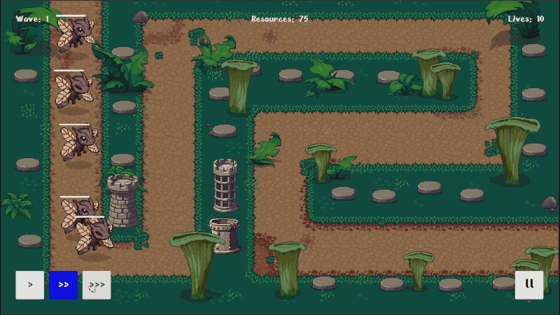

# Unity Mini Games

这里收录了几个用于作品集展示的 Unity 小游戏，以及经过整理的核心代码样本。

## Dungeon Gunner（2D Rogue）

> 一个俯视角 2D 地牢射击原型：随机生成的地牢、对象池驱动的射击战斗、拾取式武器成长——一命通关，死了直接从主菜单重来。

**[在线试玩（WebGL）](https://gamedevbaiyi.github.io/MiniGames_Presentation/2d-rogue/)**

  
  

### Selected Code

**地牢程序化生成**——随机选拓扑（节点图）、随机选房间外形（模板），重叠检测失败就换。

| File | Focus |
| --- | --- |
| [DungeonBuilder.cs](./2DRougeShowcaseCode/DungeonGeneration/DungeonBuilder.cs) | 生成算法本体：广度遍历节点图、按门连接放置房间、重叠检测与重试。 |
| [Room.cs](./2DRougeShowcaseCode/DungeonGeneration/Room.cs) | 一次生成中的房间实例：边界、门列表与父子关系。 |
| [Doorway.cs](./2DRougeShowcaseCode/DungeonGeneration/Doorway.cs) | 门的朝向与连接状态，支持深拷贝以复用同一份模板。 |
| [RoomTemplate.cs](./2DRougeShowcaseCode/DungeonGeneration/RoomTemplate.cs) | 房间外形蓝图资产：Prefab、边界与自带门。 |
| [RoomNodeGraphSO.cs](./2DRougeShowcaseCode/DungeonGeneration/RoomNodeGraphSO.cs) | 房间拓扑图数据与父子节点遍历。 |
| [RoomNode.cs](./2DRougeShowcaseCode/DungeonGeneration/RoomNode.cs) | 拓扑图里的单个节点：类型与父子 ID。 |
| [RoomNodeType.cs](./2DRougeShowcaseCode/DungeonGeneration/RoomNodeType.cs) | 房间类型枚举（入口/南北走廊/东西走廊/普通房/Boss 房）。 |

**自定义 A\* 寻路**——按房间局部网格代价寻路，用一个小接口把算法和具体的房间/Tilemap 对象解耦。

| File | Focus |
| --- | --- |
| [AStar.cs](./2DRougeShowcaseCode/AStarPathfinding/AStar.cs) | 寻路算法本体：`PriorityQueue` 驱动的开放列表、邻居代价评估、路径回溯。 |
| [IPathfindingGrid.cs](./2DRougeShowcaseCode/AStarPathfinding/IPathfindingGrid.cs) | 寻路所需的最小网格接口，解耦具体房间实现。 |
| [GridNodes.cs](./2DRougeShowcaseCode/AStarPathfinding/GridNodes.cs) | 房间局部坐标系下的寻路网格。 |
| [Node.cs](./2DRougeShowcaseCode/AStarPathfinding/Node.cs) | 单个寻路节点，保存网格坐标与 G/H/F 成本，排序规则交给调用方的优先级键。 |

**事件解耦 + 对象池的武器系统**——弹药、装填都是原本用 Coroutine 实现的异步流程，这里改写成 UniTask + CancellationToken。

| File | Focus |
| --- | --- |
| [FireWeapon.cs](./2DRougeShowcaseCode/WeaponPooling/FireWeapon.cs) | 开火节奏（蓄力/冷却/弹夹检查），连发逻辑用 UniTaskVoid 改写。 |
| [ReloadWeapon.cs](./2DRougeShowcaseCode/WeaponPooling/ReloadWeapon.cs) | 装填计时，用 UniTaskVoid + CancellationToken 改写，支持换武器时取消。 |
| [PoolManager.cs](./2DRougeShowcaseCode/WeaponPooling/PoolManager.cs) | 按 Prefab 引用复用组件的通用对象池。 |
| [Ammo.cs](./2DRougeShowcaseCode/WeaponPooling/Ammo.cs) | 从对象池取出的弹药：蓄力、飞行、命中与自我回收。 |
| [WeaponDetailsSO.cs](./2DRougeShowcaseCode/WeaponPooling/WeaponDetailsSO.cs) | 武器静态配置（外观、节奏、弹药规则）。 |
| [AmmoDetailsSO.cs](./2DRougeShowcaseCode/WeaponPooling/AmmoDetailsSO.cs) | 弹药静态配置（伤害、散布、拖尾）。 |
| [Weapon.cs](./2DRougeShowcaseCode/WeaponPooling/Weapon.cs) | 一把武器的运行时状态（弹夹/总弹药/装填进度）。 |
| [IFireable.cs](./2DRougeShowcaseCode/WeaponPooling/IFireable.cs) | 可被对象池复用并发射的最小接口。 |

## Spellbound Card Battler

> 一个 2D 回合制卡牌战斗原型：在玩家与 Boss 的交替回合中管理手牌、行动点和抽弃牌循环。

  
  

- 每个玩家回合自动将手牌补至 5 张；攻击与治疗卡共用行动点规则。
- 行动点耗尽或点击 `End Turn` 都进入同一回合切换流程，并保留 Boss 行动前后的节奏留白。
- 抽牌堆耗尽时自动回收弃牌堆并重新洗牌，运行时集合不会改写卡牌数据资产。

### Selected Code

| File | Focus |
| --- | --- |
| [TurnController.cs](./CardGameShowcaseCode/TurnAndDeckLoop/TurnController.cs) | 玩家/Boss 状态、行动点、手动结束回合与 Boss 节奏。 |
| [HandController.cs](./CardGameShowcaseCode/TurnAndDeckLoop/HandController.cs) | 回合开始补牌、出牌协调与手牌交互边界。 |
| [DrawPile.cs](./CardGameShowcaseCode/TurnAndDeckLoop/DrawPile.cs) | 运行时牌组副本、Fisher–Yates 洗牌与弃牌回收。 |
| [CardDefinitionSO.cs](./CardGameShowcaseCode/TurnAndDeckLoop/CardDefinitionSO.cs) | ScriptableObject 卡牌显示与战斗数据。 |
| [CardView.cs](./CardGameShowcaseCode/TurnAndDeckLoop/CardView.cs) | 卡牌数据绑定和最小出牌入口。 |

## Tower Defence

> 一个简洁的 2D 塔防原型：消耗资源在固定平台建造防御塔，抵御按配置生成的敌人波次。

  
  

### Selected Code

| File | Focus |
| --- | --- |
| [WaveSpawner.cs](./TowerDefenceShowcaseCode/WaveSystem/WaveSpawner.cs) | 波次节奏、敌人离场计数、任务完成与无尽模式。 |
| [WaveDefinition.cs](./TowerDefenceShowcaseCode/WaveSystem/WaveDefinition.cs) | 敌人类型、数量与生成间隔配置。 |
| [WaveEnemy.cs](./TowerDefenceShowcaseCode/WaveSystem/WaveEnemy.cs) | 敌人生命与离场事件边界。 |

## 3D Runner

> 一个 3D 无尽跑酷原型：玩家在持续前进的跑道上切换车道、收集金币与加速道具，并躲避障碍物。

  

### Selected Code

| File | Focus |
| --- | --- |
| [LevelGenerator.cs](./RunnerShowcaseCode/LevelGeneration/LevelGenerator.cs) | Chunk 流、回收边界、检查点插入与速度编排。 |
| [ChunkPool.cs](./RunnerShowcaseCode/LevelGeneration/ChunkPool.cs) | 按预制体划分的对象池与生命周期管理。 |
| [Chunk.cs](./RunnerShowcaseCode/LevelGeneration/Chunk.cs) | 可复用 Chunk 和无冲突的三车道内容布局。 |

## Scope

仓库只保留作品集所需的演示画面与精选代码。完整 Unity 工程、场景和美术源文件未包含在内。
